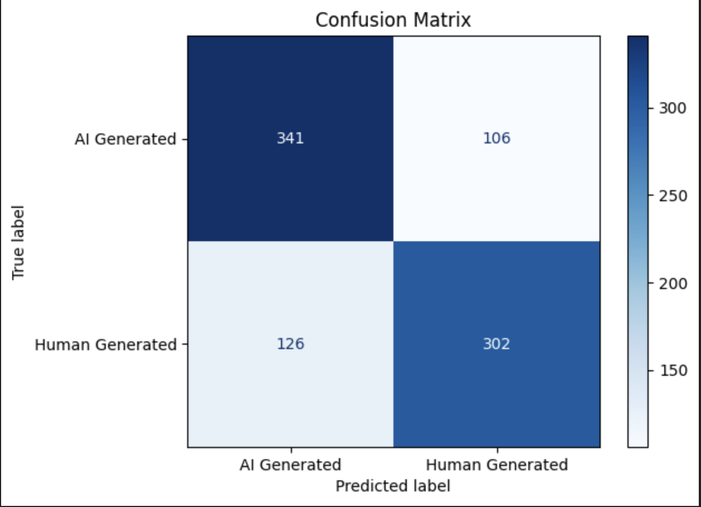

# A quick summary of the AI vs Human Text classification task.

Several approaches are available to perform such classification task. Syntactic and semantic patterns  e.g.
- using more uniform sentences
- using monotonous language
- [frequent use of a certian phrases](https://gptzero.me/ai-vocabulary)
- probability distribution of their generated tokens etc.
in LLM generated texts are exploited to create such classifiers. Using logits is the most common approach for differentiating between ai and human textx. 
Hence, taking inspiration from [GhostBuster](https://arxiv.org/abs/2305.15047), [Binoculars](https://arxiv.org/abs/2401.12070), [Fast-DetectGPT](https://arxiv.org/abs/2310.05130), and [Syntactic Templates in AI text](https://arxiv.org/pdf/2407.00211) following classifier has been trained.

## Dataset
Several datasets are available for this task. Considering the contraint on time and compute, I have used [Beemo](https://huggingface.co/datasets/toloka/beemo) dataset which has 2187 rows and 10 columns `['id', 'category', 'model', 'prompt_id', 'prompt', 'model_output', 'human_output', 'human_edits', 'llama-3.1-70b_edits','gpt-4o_edits']`. For each `prompt` both human (`human_output`) and model(`model_output`) answers have been provided. `'human_edits', 'llama-3.1-70b_edits','gpt-4o_edits'` columns has `model_output` data edited by human, llama3-70b and gpt4o models.

## Classifier
Currently logistic classifier has been trained using following created features from logits and text content.

## Features
Due to time contraint I could only focus on features created with logits of these llms. Apart from no of tokens, no other feature syntact features was used. But can be explored in future. Current features include:
- perplexity of the paragraph
- coefficient of variation of perplexity for the sentences in the paragraph i.e. how much variation is there in the perplexity of the sentences. Idea is to capture monotonous nature of the text
- score provided by binocular classifier approach. binocular scores are based on perplexity and lower binocular score imply ai generated text
- fast-detectgpt score: it is based on probability of the tokens
- rest of the features are combinations of scalar and vector operations performed on log probabilities of the tokens (taking inspiration from [GhostBuster](https://arxiv.org/abs/2305.15047))

## Result
Used `scikit`'s `RFECV` to select features with cross validation such that the F1 (beta=0.5) is maximized. Divided train and test set in the ratio of 80-20. Final trained model is giving F1(beta=0.5) (for AI text ) of 75.8. And on the test set F1(beta=0.5) is 72. `RFECV` selected 8 most important features including binocular score, fast detectget score, perplexity, no of words in text and other log_probs based features. Following is the connfusion matrix of the test set.
